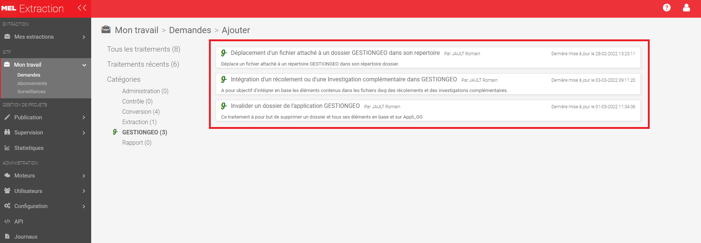

# Documentation GESTIONGEO: Utilisation des chaines de traitements FME.

## 1. Ojectif:
Le but de ce document est d'expliquer comment utiliser les chaines de traitement FME dans le cadre de l'application __GESTIONGEO__.

## 2. Outil à utiliser:
Les chaines de traitement FME utiliser dans le cadre de l'application __GESTIONGEO__ sont disponibles à travers notre formulaire GTF:
- [Formulaire GTF](https://gtf.lillemetropole.fr/extraction/login) ;  

## 3. Lancer un traitement depuis GTF:

### 3.1. Etapes:
1. Après votre connexion sur l'interface GTF, vous serez automatiquement sur l'onglet __Mes extractions__. Vous devez vous rendre dans l'onglet __mon travail__.

2. cliquez sur le bouton puis __demande__ puis __+ Ajouter__ présent sur la partie en haut à droite de la page.

3. choisissez la catégorie __GESTIONGEO__

4. choisissez l'une des trois chaines de la catégorie suivant votre besoin.

### 3.2. Traitements disponibles:
Dans le cadre de l'application GESTIONGEO, trois chaines de traitement FME sont disponibles:

1. Intégration d'un récolement ou d'une Inverstigation complémentaire dans __GESTIONGEO__.
2. Déplacement d'un fichier attaché à un dossier __GESTIONGEO__ dans son répertoire.
3. Invalider un dossier de l'application __GESTIONGEO__.

#### 3.2.1. Intégration d'un récolement ou d'une Inverstigation complémentaire dans __GESTIONGEO__.

##### 3.2.1.1. Utilisation de la chaine.

Pour fonctionner, cette chaine necessite trois paramètres.
1. Fichier source autocad à insérer
2. Le type de dossier, s'il s'agit d'un récolement ou d'une investigation complémentaire
3. Le numéro du dossier. A récupérer sur l'interface QGIS lors de la création de dossiers.
Une fois les paramètres renseignés vous pouvez cliquez sur l'onglet envoyer la demande.

##### 3.2.1.2. Fonction de la chaine.

Le but de cette chaine est d'intégrer dans la base de données les éléments issus des récolements.
Cette chaine, si le dossier est un récolement réalise les opérations suivantes:

* Intégre les éléments contenus dans le fichier autocad indiqué dans les tables:
	* __GEO.TA_POINT_TOPO_GPS__.
	* __GEO.TA_LIG_TOPO_GPS__.
	* __PTOPO__.
* Met à jour la géométrie du périmètre du dossier.
* Déplace le fichier intégré dans le répertoire du dossier et le renomme suivant le nombre de dossiers déjà intégrés, son numéro de dossier et le code insee du dossier.
* Rajoute le fichier intégré dans la table __G_GESTIONGEO.TA_GG_FICHIER__. Ajoute un 1 dans la colonne __INTEGRATION__ de la table pour indiquer que ce fichier est celui qui a été intégré dans les tables des éléments géométriques pour le dossier considérer.

Dans le cadre d'un dossier d'Investigation complémentaire:
* __Aucun élément géographique ne sera intégrer dans les tables en base__
* Met à jour le périmètre du dossier.
* Rajoute le fichier intégré dans la table __G_GESTIONGEO.TA_GG_FICHIER__. Ajoute un 0 dans la colonne __INTEGRATION__ de la table car les éléments contenus dans le fichier autocad ne sont pas insérés dans les tables des éléments topographique en base.

##### 3.2.1.2. Fonction de la chaine.

#### 3.2.2. Déplacement d'un fichier attaché à un dossier __GESTIONGEO__ dans son répertoire.

##### 3.2.2.1. Utilisation de la chaine.

Pour fonctionner, cette chaine necessite deux paramètres.
1. Fichier à déplacer.
2. Le numéro du dossier. A récupérer sur l'interface QGIS lors de la création de dossiers.
Une fois les paramètres renseignés vous pouvez cliquez sur l'onglet envoyer la demande.

##### 3.2.2.2. Fonction de la chaine.

Le but de cette chaine est de déplacer dans son répertoire dossier un fichier qui n'est pas destiné à être intégré dans les tables des éléments topographiques. Cette chaine peut servir à déplacer dans son répertoire dossier des fichiers de différents formats, word, pdf, txt par exemple
cette chaine effectue les opérations suivantes:
* Déplace le fichier fourni dans le répertoire du dossier et le renomme suivant le nombre de dossiers déjà intégré, son numéro de dossier et le code insee du dossier.
* Rajoute le fichier déplacé dans la table __G_GESTIONGEO.TA_GG_FICHIER__. Ajoute un 0 dans la colonne __INTEGRATION__ de la table car les éléments ne sont pas insérés dans les tables des éléments topographiques en base.

#### 3.2.3. Invalider un dossier de l'application __GESTIONGEO__.

##### 3.2.3.1. Utilisation de la chaine.

Pour fonctionner, cette chaine necessite deux paramètres.
1. Le numéro du dossier. A récupérer sur l'interface QGIS lors de la création de dossiers.
2. Le type de suppression.
Une fois les paramètres renseignés vous pouvez cliquez sur l'onglet envoyer la demande.

##### 3.2.3.2. Fonction de la chaine.

La chaine __Invalider un dossier de l'application GESTIONGEO__ à pour objectif de supprimer un dossier de l'application. Deux types de suppression sont possibles. La première va supprimer complètement un dossier, son périmètre, son répertoire, ses éléments dans les tables de l'application __GESTIONGEO__. Le deuxième type de suppression ne va supprimer que les éléments topographiques du dossier. 

## 4. Après la demande.

Suite à la demande de traitement l'outil GTF présente la fenètre de supervision de l'execution de la chaine. Cette fenètre est très utile pour suivre l'évolution du traitement. Elle présente sous forme de tableau l'ensemble des traitements effectué par l'outil GTF.

1. Id: identifiant du traitement
2. Projet FME: nom du traitment executé.
3. Etat du traitement: code couleur donnant une indication sur l'avancement du traitement

4. résultat: permet de telecharger le resultat si le traitement le prévoit.
5. Utilisateur: Nom de l'utilisateur qui a lancé le traitement
6. Date de la demande: date à laquelle
7. Paramètres: Paramètres entrés lors du lancement de la chaine.
8. Priorité: valeur par défaut
9. durée: Durée du traitement
10. Copie: adresse courriel à une personne qui sera avertit lors de la fin de l'execution de la chaine.
11. Log FME: Fichier journal du traitement à l'issue de l'execution de la chaine. Très pratique en cas d'échec pour analyser à quelle étape un problème est survenu.
12. Supprimée: vide par défaut
13. Moteur: GTF par défaut
14. Date de traitement:
15. date de planification

