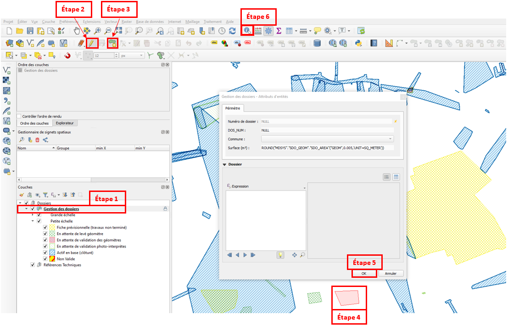
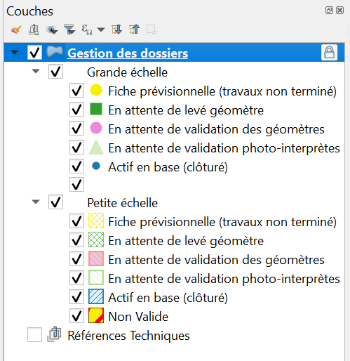
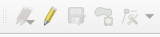
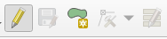
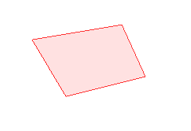
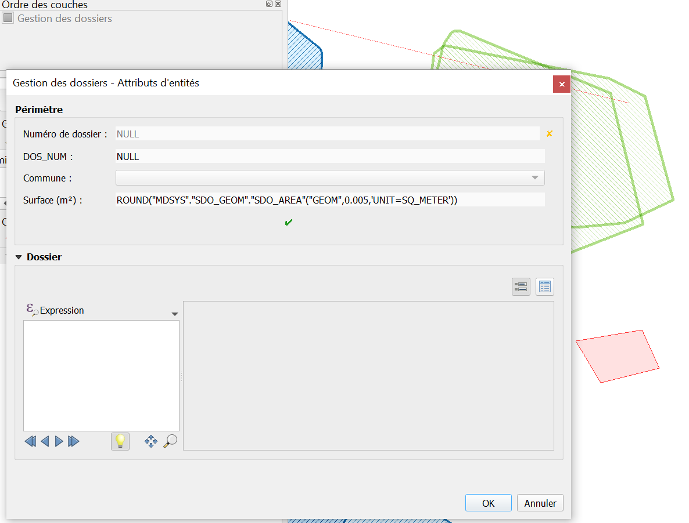
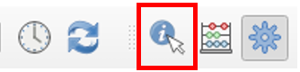

# Documentation GestionGeo : Guide utilisateurs

## Objectif : 
Permettre aux utilisateurs de l'application GestionGeo de saisir des dossiers de levé, d'intégrer les levés en base et de clôturer le dossier.

## Outils a utiliser :
- QGIS ;
- [Formulaire GTF](https://gtf.lillemetropole.fr/extraction/login) ;  
  
Voici comment se présente une fenêtre QGIS, n'hésitez pas à venir vous y référer lorsque vous chercherez les outils utilisés dans les étapes ci-dessous :

## Etape 1 :
1. Dans votre projet QGIS de saisie, allez dans le contrôle des couches à gauche et sélectionnez la couche *gestion des dossiers* ;  

2. Mettez la couche en mode édition en cliquant sur le *crayon jaune* ;

3. Suite à la mise en édition l'outil *ajouter une entité polygonale* s'est colorisée, cliquez dessus ;

4. Dessiner le périmètre de votre dossier dans la fenêtre carte. Utilisez le clic gauche pour dessiner et **terminez par un clic droit** ;

5. Après avoir dessiné votre périmètre, un formulaire s'ouvre automatiquement. Ne remplissez rien et cliquez sur **OK** en bas à droite. Par défaut votre dossier s'affichera en fiche prévisionnelle, mais vous pourrez le changer à l'étape d'après ;

6. Cliquez sur *Identifier des entités* et cliquez (clic gauche) sur le périmètre que vous venez de dessiner, ce qui ouvrira un formulaire ;

7. Remplissez les champs que vous pouvez et cliquez sur **OK** ;

8. Enregistrez votre dossier en cliquant sur *Enregistrer les modifications de la couche*. Votre dossier est maintenant créé en base et vous allez pouvoir y importer les levés topographiques;

9. Allez dans le formulaire GTF en cliquant sur ce [lien](https://gtf.lillemetropole.fr/extraction/login) ;

10. Connectez-vous avec vos identifiants de session ;

11. 