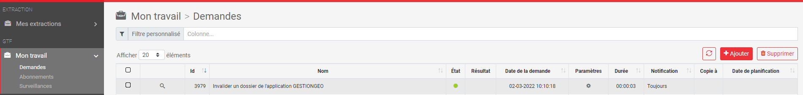

# Documentation GestionGeo : Guide utilisateurs

## Objectif : 
Permettre aux utilisateurs de l'application GestionGeo de saisir des dossiers de levé, d'intégrer les levés en base et de clôturer le dossier.

## Outils à utiliser :
- QGIS ;
- [Formulaire GTF](https://gtf.lillemetropole.fr/extraction/login) ;  
  
Voici comment se présente une fenêtre QGIS, n'hésitez pas à venir vous y référer lorsque vous chercherez les outils utilisés dans les étapes ci-dessous :

## Etapes :
1. Dans votre projet QGIS de saisie, allez dans le contrôle des couches à gauche et sélectionnez la couche *gestion des dossiers* ;  

2. Mettez la couche en mode édition en cliquant sur le *crayon jaune* ;  

3. Suite à la mise en édition l'outil *ajouter une entité polygonale* s'est colorisée, cliquez dessus ;  

4. Dessiner le périmètre de votre dossier dans la fenêtre carte. Utilisez le clic gauche pour dessiner et **terminez par un clic droit** ;  

5. Après avoir dessiné votre périmètre, un formulaire s'ouvre automatiquement. Ne remplissez rien et cliquez sur **OK** en bas à droite. Par défaut votre dossier s'affichera en fiche prévisionnelle, mais vous pourrez le changer à l'étape d'après ;  

6. Cliquez sur *Identifier des entités* et cliquez (clic gauche) sur le périmètre que vous venez de dessiner, ce qui ouvrira un formulaire ;  

7. Remplissez les champs que vous pouvez dans les onglets *Généralités* et *Date des travaux / levés* et cliquez sur **OK**. Pour cette action vous avez le choix, en fonction des champs, entre :  
- Une liste déroulante ;  
  
- Un champ proposant des valeurs déjà en base et permettant la saisie (l'objectif est de n'avoir que des valeurs uniques et d'éviter d'avoir le même nom écrit en minuscule et en majuscule) ;  
  
- Un calendrier ;  
  

8. Enregistrez votre dossier en cliquant sur *Enregistrer les modifications de la couche*. Votre dossier est maintenant créé en base et vous allez pouvoir y importer les levés topographiques ;  
  

9. Allez dans le formulaire GTF en cliquant sur ce [lien](https://gtf.lillemetropole.fr/extraction/login) ;  

10. Connectez-vous avec vos identifiants de session ;  
  

11. Dans le menu situé à gauche, cliquez sur **Mon travail**, puis sur **Demandes** ;
  
  

12. Cliquez sur **Ajouter** en haut à droite ;
  

13. Cliquez sur **Intégration d'un récolement ou d'une Investigation complémentaire dans GESTIONGEO** afin d'insérer les levés en base ;
  

14. Sélectionnez le **fichier dwg ou dxf à intégrer**, puis sélectionnez le type de dossier, saisissez le **numéro du dossier** (présent dans le formulaire qgis), puis cliquez sur **Envoyer la demande**. Le périmètre sera **modifié** en fonction des données que vous allez intégrer dans cette étape ;  
  

15. L'intégration peut prendre un peu de temps et le logo de l'état du dossier passera du bleu au rose jusqu'au vert, couleur indiquant que les données ont été correctement intégrées correctement en base. S'il est rouge ou noir c'est qu'il y a eu une erreur et l'intégration ne se fera pas ;  
  

16. L'étape précédente va également recalculer le périmètre du dossier qui sera mis à jour suite à l'intégration. Pour retrouver votre dossier dans qgis, sélectionnez la couche *gestion des dossiers* dans QGIS, cliquez sur **Sélectionner des entités par valeur**, renseignez le numéro du dossier, cliquez sur **Sélection des entités**, puis sur **Zoom sur les entités** ;  
- Outil **Sélectionner des entités par valeur** :  
  

- Formulaire :  

Vous pourrez alors observer que le périmèter a été redesiné :  
